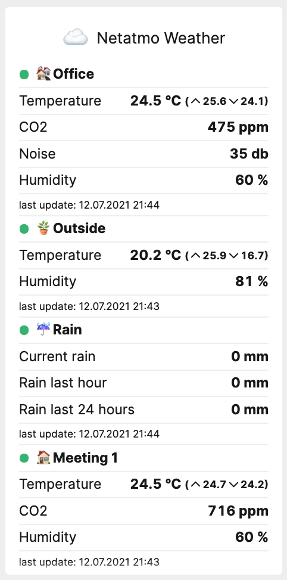

# A tile to display your Netatmo weather stations



[](https://packagist.org/packages/pschocke/laravel-dashboard-stadtwerke-muenster-bus-tile)

This tile can be used on the [Laravel Dashboard](https://docs.spatie.be/laravel-dashboard) to display all or just some of your Netatmo weather stations.

## Installation

You can install the package via composer:

```bash
composer require pschocke/netatmo-weather-laravel-dashboard-tile
```

#### Creating a Netatmo OAuth App

Before we can access the Netatmo API to get the weather data, you first need to [create an OAuth App](https://dev.netatmo.com/apps/createanapp#form). Netatmo only allows the owner of an app to use the password auth grand, so be sure to create the app with the same account that has all your devices registered.

#### Configure the config file
In the `dashboard` config file, you must add this configuration in the `tiles` key. Since package uses the password oauth authorisation grand, you need to provide the e-mail and password of your netatmo account.

```php
// in config/dashboard.php

return [
    // ...
    'tiles' => [
        'netatmo-weather' => [
            'client_id' => env('NETATMO_CLIENT_ID'),
            'client_secret' => env('NETATMO_CLIENT_SECRET'),
            'email' => env('NETATMO_ACCOUNT_EMAIL'),
            'password' => env('NETATMO_ACCOUNT_PASSWORD')
        ]
    ]
];
```

Make sure you also create the matching entries in your `.env` file.

#### Register the cronjob

In `app\Console\Kernel.php` you should schedule the `\Pschocke\NetatmoWeatherTile\FetchNetatmoWeatherDataCommand` to run. Since Netatmo only updates its data every 10 minutes on their server we only need to run our command every 10 minutes.

```php
// in app/console/Kernel.php

protected function schedule(Schedule $schedule)
{
    // ...
    $schedule->command(\Pschocke\NetatmoWeatherTile\FetchNetatmoWeatherDataCommand::class)->everyTenMinutes();
}
```

## Usage

In your dashboard view you use the `netatmo-weather-tile` component. 

```html
<x-dashboard>
    <livewire:netatmo-weather-tile position="b1:b4" />
</x-dashboard>
```

##### Displaying only specific stations

If you want to display only a few of your stations in one tile you can specify which stations should be shown by providing the `:show-devices` attribute:

```html
<x-dashboard>
    <livewire:netatmo-weather-tile position="b1:b4" :show-devices="['Office', 'Rain']"/>
</x-dashboard>
```

### Customizing the view

If you want to customize the view used to render this tile, run this command:

```bash
php artisan vendor:publish --provider="Pschocke\NetatmoWeatherTile\NetatmoWeatherTileServiceProvider" --tag="dashboard-muenster-bus-tile-views"
```

## Testing

```bash
composer test
```

## Contributing

Please see [CONTRIBUTING](CONTRIBUTING.md) for details.

### Security

If you discover any security related issues, please email patrick@ausbildung-ms.de instead of using the issue tracker.

## Credits

-   [Patrick Schocke](https://github.com/pschocke)
-   [All Contributors](../../contributors)
